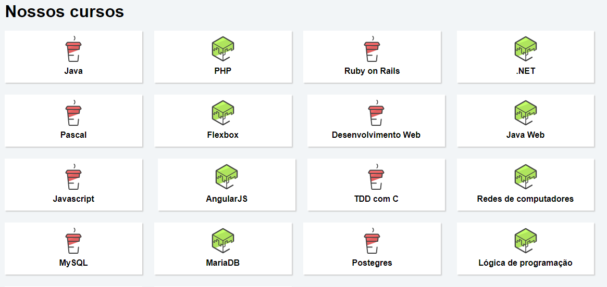

# Flexbox

### Projeto desenvolvido para o curso de *Flexbox: Posicione elementos na tela* do instrutor Yuri Padilha (Alura).

### 📚  Descrição

Objetivos do curso:

- Aprender a especificação flexible box para posicionar elementos na página;

- Entender as diversas propriedades do flexbox e como usá-las;

- Entender como as propriedades do flexbox substituem float, inline e inline-block;

- Elaborar um site responsivo com flexbox.

### 🖥️  Instalações

- [Visual Studio Code](https://code.visualstudio.com/download)

### ⚒️  Tecnologias

- [HTML](https://developer.mozilla.org/en-US/docs/Web/HTML)
- [CSS](https://developer.mozilla.org/en-US/docs/Web/CSS)

&nbsp;

##### Clique na imagem para visualizar a página:

&nbsp;

